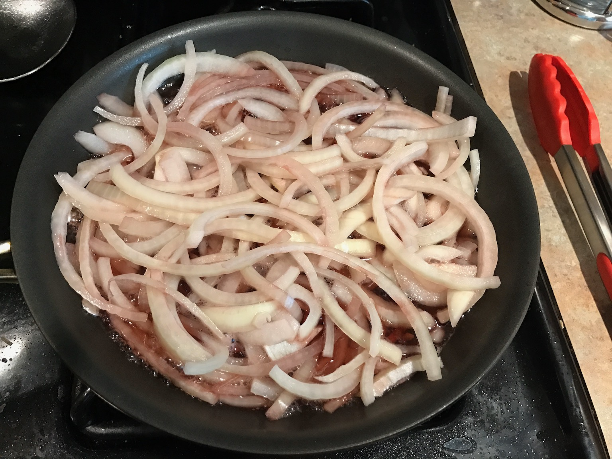
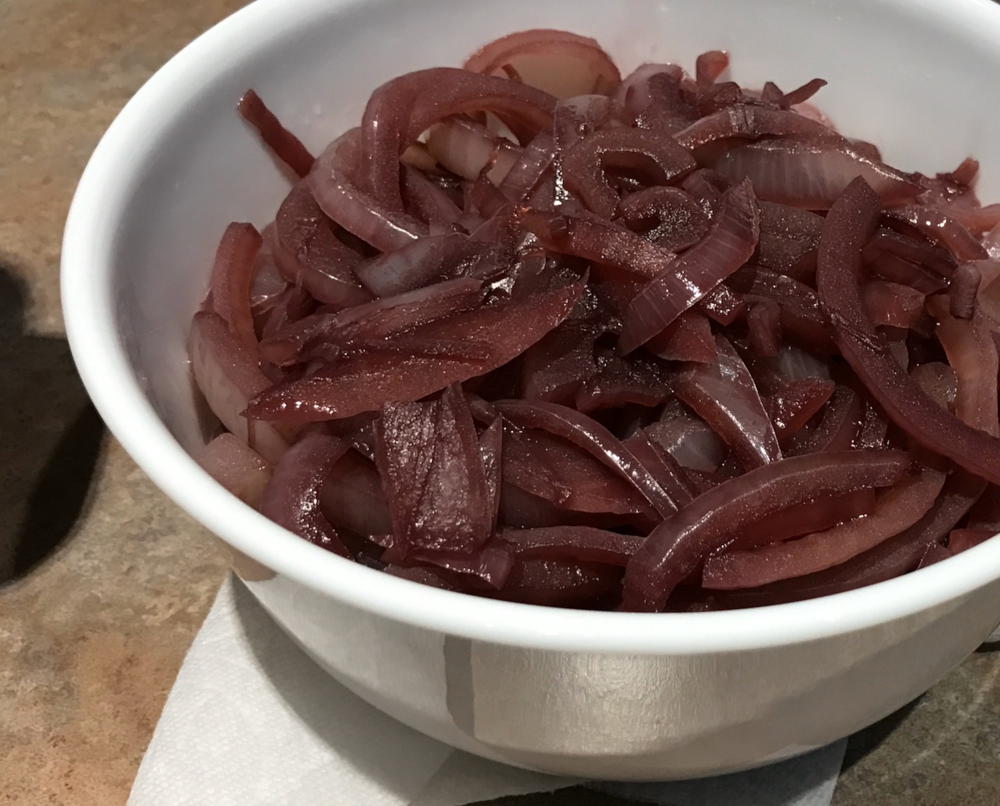
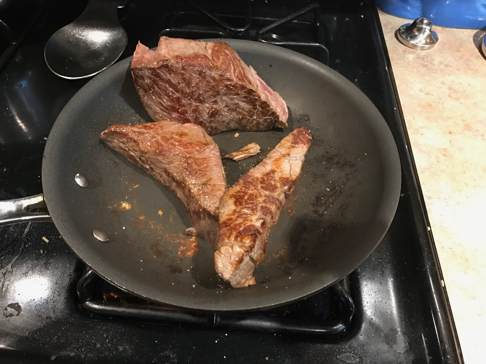
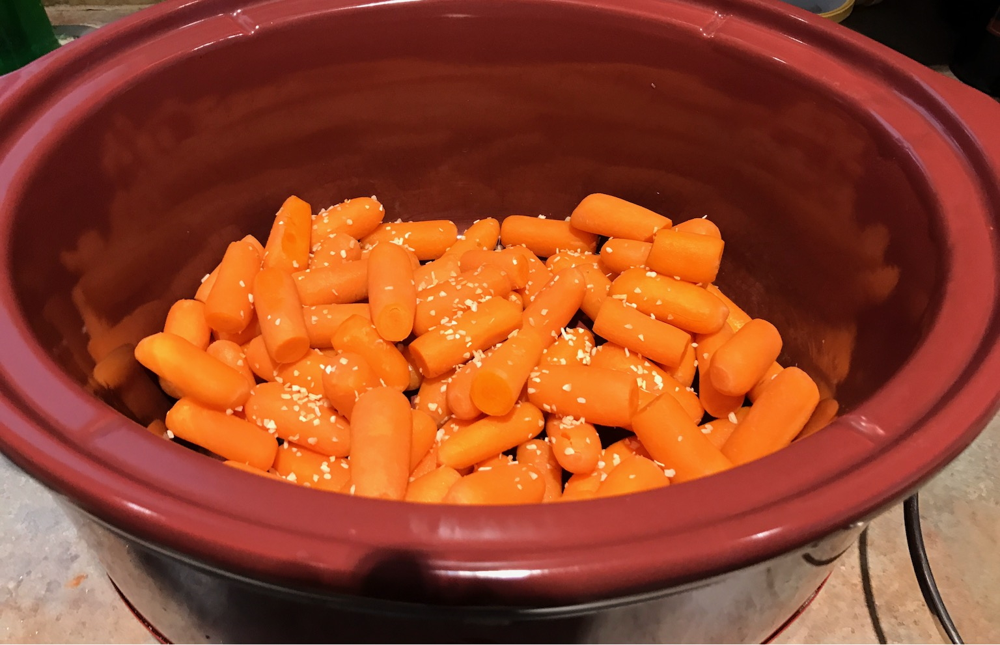
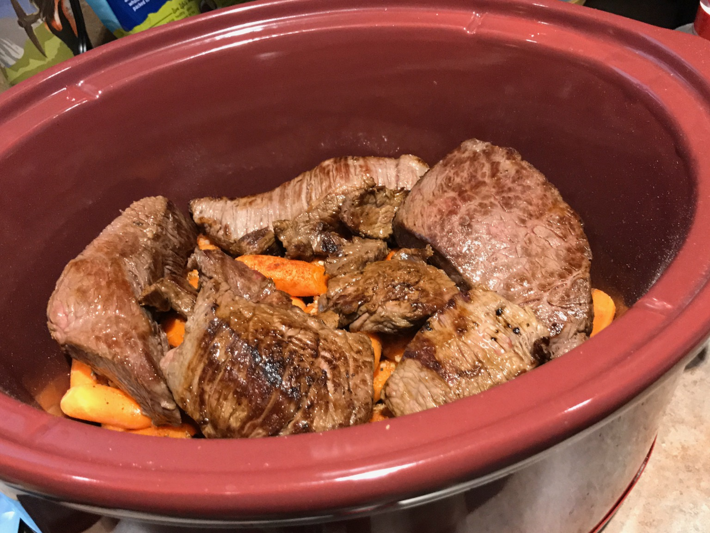
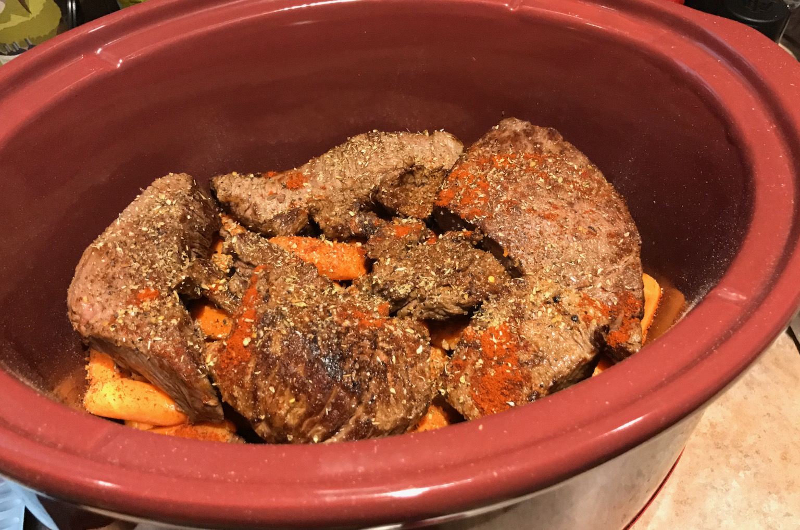
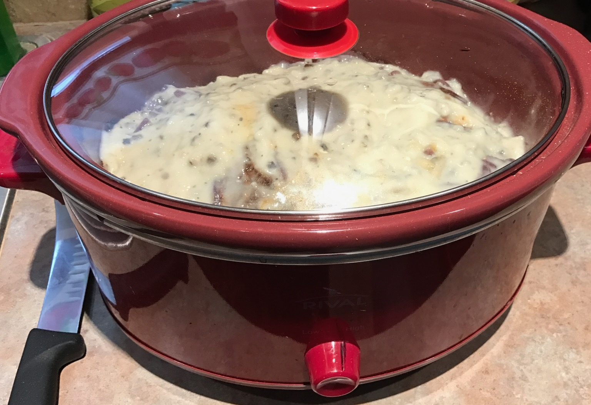
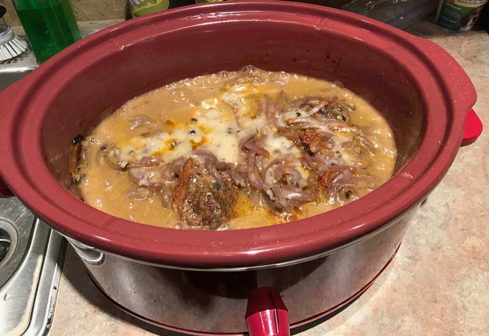
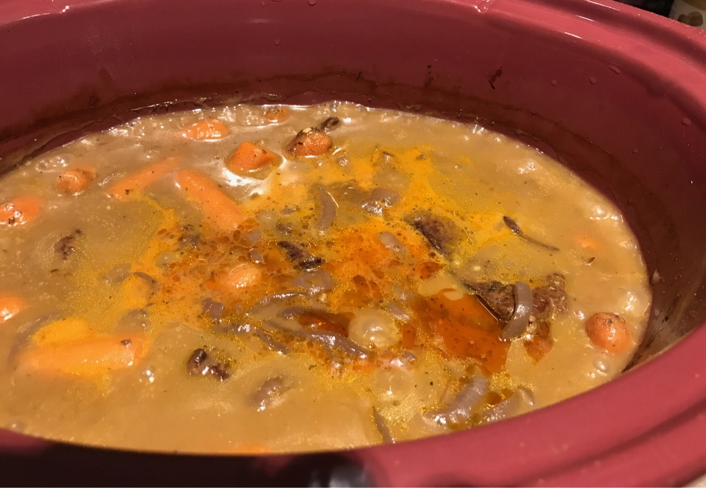

# Dave's Potroast

## Ingredients

- Hunk of beef (as big or small as you like, I usually shoot for 3 lbs, or as large as I can get)
- One or more Yellow or White Onion(s)
- Baby carrots (amount variable, depends on how much you like carrots, or how much you're making)
- Suggested Spices
  - Onion Powder
  - Garlic Powder
  - (optional) dried diced onion
  - Salt
  - Pepper
  - Oregano

## Hardware

- Fry and/or Sauté pan
- Slow cooker or Instapot

## Introduction

This recipe is for a pretty tasty potroast I've iterated on over the years. Best hunks of meat IMHO are:
- For the traditional: chuck roast. A little fiddly if you dont cut out the fat/gristle for your diners
- For the lazy: tritip roast. Comes out almost as nice, with very little trimming to do
- For the fortunate: top sirloin roasts work great, they just dont turn up at the store that often
- For the random: "chuck arm roast" also turns out pretty well. Sometimes I see them a lot, sometimes not for months at the store
- For the lucky: well. anything else. Hopefully it turns out for you :)

## Prep Instructions

1. Slice Onions
1. Wash carrots (or dont, I'm not your mother)
1. Sauté onions in small amount of fat (butter or olive oil work fine) until they darken and become translucent. 

1. Add up to a cup of wine and slowly simmer for an additional few minutes until it has reduced somewhat. Move to bowl

1. Wipe out pan, return to stove.
1. If necessary, trim fat/gristle out of roast
1. Rub meat with oil
1. Put pan on medium high heat
1. Put meat in pan, salt exposed side. 
1. Cook until well browned, rotate to unbrowned side

1. While you wait, dump carrots into slow cooker, and arrange so that you have as few number of levels as possible
1. Season carrots with a light dusting of all the seasonings listed above to taste. Imagine you're just going to eat the cooked carrots, and season them appropriately.
1. Optional: sometimes I like to throw a few diced dehydrated onions in with the carrots. I figure they sop up some of the moisture that everything is going to release.

1. Repeat beef browning until all sides are browned.
1. Stack them on top of the carrots

1. Season the meat with all the spices, again to taste as though you were just going to eat the meat.
1. At this point you can add a half a cup of wine if you think any of your ingrdients are either unusually dry, or you're worried about moisture content for some other reason (you like very thin sauce or something)...or if you really just like wine. See instructions later about how to thicken sauce.

1. Put some mushroom soup on top. I like pacific brand. usually one cube is enough. (using two as pictured for what is in the pics was a bit excessive)

1. Level the soup out, and put the lid on the cooking vessel

## (Slow) Cook Instructions
### Slow Coker
1. Put cooker on high. After about an hour when you see serious bubbling, you can turn it down to low
1. The cooking will take about 4-5hrs total
1. Around the midpoint-ish (3 or 4hrs) the food will look like this. This is the fools offramp. keep on cookin.

1. The cooking should be all or nearly complete when everything looks the same color and you see a pool of fat come out on top similar to this

### Instant pot style cooker
1. Set for 1hr of high pressure
1. Allow the pot to coast for 30m on keep warm after it beeps from finishing the pressure stage

## Adjusting the end product
1. If you find that your sauce is thinner than you like, I usually thicken it up just a bit with mashed potato flakes (which I keep around just for thickening things, not to actually make mashers out of)

1. Sprinkle some flakes on top and stir them in. I usually do this a few times and stir. Stop short of actually thickening it all the way (maybe 2/3rds between where you started and where you want) and let it cook for a few minutes.
1. This will both allow the flakes time to dissolve and properly integrate, and for the sauce to fully thicken...or you may over-thicken.

## Eat!
1. Serve as is, or alongside (real) mashed potatoes, boiled potatoes, etc. 
1. If you want, you can add yellow or red potatoes directly to the potroast recipe. Just make sure to adjust your moisture up a little bit, and your seasoning up a fair amount. Also be cognizant of the fact that this will probably add an extra hour to the cook time.

