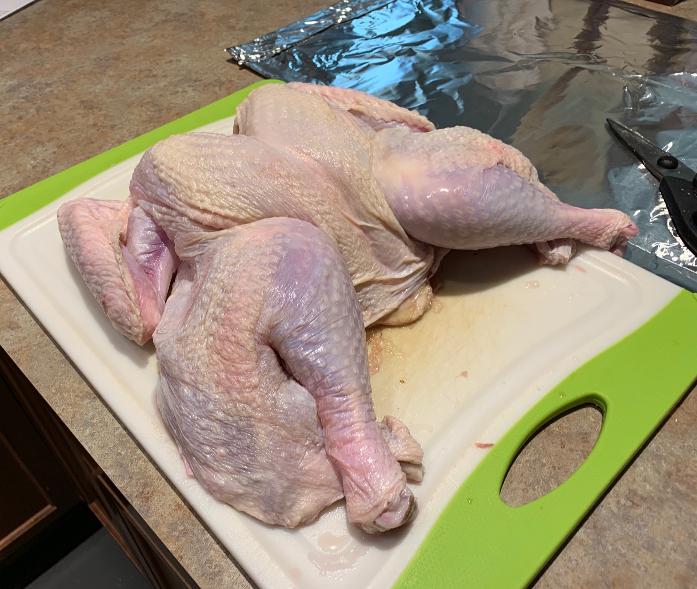

# Dave's Minimized-prep Spatchcocked Grilled Turkey

```
TODO: 
- Add spice rub ingredients/measurements. 
- Add in metric for any imperial units. 
- Clarify/edit.
```

## Ingredients

- An Frozen Turkey, as natural as possible, but still one that was soaked in some kind of salt solution to save time (butterball natural for example)
- Spice Rub
- Optional: foil pie tin full of wood chips of your choice

## Hardware

- Some variety of Grill (gas grill used as an example, wood pellet, charcoal etc. should all work though)
- Probe thermometer
- ***Heavy*** duty kitchen shears, especially if you prefer larger turkeys. Preferably ones that come appart at the hinge so they can be cleaned out properly (dishwasher)
- Aluminum foil

## Introduction

This recipe is designed to maximize flavor and minimize prep time. There are probably faster or tastier, but imho this is the best bank for your invested minute. During the cook phase there is also enough time to make dressing, gravy, and boil/bake potatoes. This is loosely based on the cooking methods of Alton Brown's dry brine poultry from "Countdown to T-Day" special as well as some of his tips from his "Right on Q" special. This recipe works well on all sizes of turkey (tested from 8lbs to 21lbs, but 14-16lbs is the sweet spot, pictures are of an 9lb turkey). I focused on minimizing the time involved because I like to show up at my parents house at 11:30a, start prep, and be done cooking by 3p. The only prep my parents can be trusted to do ahead of time is thaw the turkey in the fridge. Apologies ahead of time, my instructions are pretty specific/verbose, but usually thanksgiving is not a time when people enjoy ambiguity in cooking directions.

## Prep Instructions

1. (N days ahead) Thaw the turkey in the fridge (which takes minmum 2 days for an 8lb, 3 for a 14lb, and 4+ for a 20lb). If you opted to get a turkey that is not presoaked in at least some amount of salt water...you're either looking at a dryer turkey using the normal 30m prep below, or a longer prep time. The longer prep time variant: you can add two tablespoons of salt to the spice mix and spatchcock it 1-4 days early, douse it in rub, and leave it in the fridge on a rack/foil (be careful about managing runoff). 

1. (Whenever ahead of time) Prepare the spice rub. Mix all the spices together. For best results, blend in a coffe grinder until fine, then throw into an old spice bottle with a shaker top. (I just use an old oregano or montreal steak seasoning container...nothing fancy)

## Cook Instructions
- Grill Prep- If you don't trust the grill in question, now is the time to preheat. Also check that you'll have 1-3hrs of fuel plus 20-30m for preheat. We're going for 400-450. If the grill in question is not well maintained/cleaned, you might start high to burn anything off (don't want a grease fire halfway through!--I found what I can only describe as the bottom 1/4th of a salmon filet fused to the grate when I started this year). This recipe shouldn't cause any major grease issues though, since we're going to put aluminum foil under the turkey, which will limit drippings straight down, and limit fire under the turkey. For a standard webber gas grill with the 3 burners, I like to go medium-low for the top, low for the middle, and medium-low on the top (or even lower if your grill can maintain 400-450 with less). Keep in mind that the burner config on a webber is more like an 'E' than 3 lines, because of the crossbar, so I also bias foods away from that vertical link between the burners (especially when it comes to running the thermometer probes, run them in the other side of the grill).

1. Fetch out your turkey. Move to sink. Cut open the bag, drain out any excess liquid. Remove neck from one end and set aside for gravy/soup/etc., remove giblets from the other end. I discard the giblets, but feel free to do what you like with them.
1. Place turkey on the most giant plastic cutting board available. (If a non porous counter is available, this also works...just make sure not to scratch their countertop and to sanitize the hell out of it when you're done)
1. Remove any other misc hardware (such as random things installed to hold the legs in place) *except* the thermometer. Leave that in, or it will just make a hole for juices to escape. 

1. Flip the turkey over so that you're looking at where the backbone comes out near the drumsticks. Start cutting up one side of the backbone. If you get stuck, start cutting up the other side of the backbone, grab the section of backbone you have cut on both sides, then you can leaver that out, then you can start cutting up the sides again. On a stubborn turkey you might have to go as many as 4 different sections to get the whole thing out. Also wiggling the shears as you cut (side to side)...and just being patent, will eventually get that bugger out. Set all the backbone chunks aside with the turkey neck.

1. Trim up any random flaps or things that are just hanging off now that the backbone is out. Usually I have to at least trim up the area near the legs and the neck end, of random blobs of fat and skin. Don't go crazy though, we still want the skin that's attached to the turkey and not loose to stay so we can crisp it up, and to give protection to the meat as it cooks. You'll probably also need to mop up around the turkey at this point, as well as in the cavity.

1. Flip the turkey over so the lack of backbone is now down towards the cutting board. Spread the hole where the backbone used to be open as much as possible as you set the turkey down, then firmly press down on the turkey sternum. You should hear two sets of cracks as the ribs crack open, and the turkey will flatten out.

1. Pull down a bit on the legs as you hold down with the other hand to stretch the bird out a bit.
1. Grab each wing and fold it so that is behind the mass of the turkey (think of it like he's putting his arms behind his head and relaxing)
1. Once he's all flat and tidy, flip him back over again, and spice the underside and what was formally the inside of the turkey.

1. While you leave that for a minute or two to adhere, take two sheets of heavy duty foil and crimp them together at the edges so that they make a larger piece of foil. If you have a heavy turkey (aka probably anything over 10lbs) you may want to do this twice, so you have a double thick, double width piece of foil. The width should now be about 24", and the length should be something that comfortably fits in your grill, usually about 36" (you can roll it up into a little side wall if there's excess later).
1. Once your foil is ready and it's been a couple minutes, flip the turkey on to the foil, so the breast side is now up. Season liberally. Insert your probe thermometer along the sternum from the head end of the turkey 4-6" in, until the tip is roughly about 60% the way into the breast along that line.

1. Sounds like a lot, but that should take 20-30m tops. 
1. [Optional] If you're using the optional smoke packet for your grill, just before moving the turkey to the grill, grab some tongs, remove the top grate, and place the packet near one of the burners


1. Plop the whole turkey with foil tray and all onto the grill, slightly biased away from the vertical cross bar horizontally if your grill has one, and centered on the vertical. Run your probe wire(s) out the side of the grill that has the least amount of burners on the way out.
1. Roll up the edges of the foil so that they're about 1" from the bird on all sides.

1. Set your grill thermometer for 160F to 162F. 
1. Go cook side dishes!
1. When 160F rolls around, go out with an instant read thermometer, and temp around. Depending on the size/evenness of thawing of the bird, it will either all finish at once, or your thighs/legs may lag behind 10F or so. If the dark meat lags behind, it is usually pretty easy to pull just the white meat section (use tongs to gently dislodge the thighs from the ribcage and leave both thighs sitting there while you evacuate the torso section to a platter)


1. Get the bird in the house! Rest at least until the temperature starts to fall (usually it will continue upward for at least a few degrees before staring to fall, hence pulling it at 160ish rather than the expected 165 fully cooked temp.
1. Carve! I usually carve each breast off whole, and then slice straight down so each slice has a little bit of skin.
1. Eat!


## Optional Related Side instructions:

### Gluten free gravy

### Gluten free Dressing (nee Stuffing)


